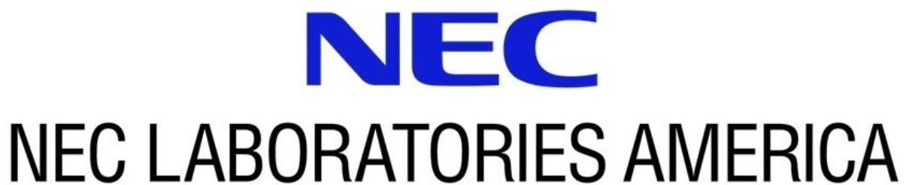

* *2025/11*: 🥳 I will join NEC Labs America  as a Research Intern in Spring 2026, working on Multimodal Reasoning and Vision Language Models.

* *2025/8*: 🥳 My internship Johnson & Johnson  is extended to full semester.

* *2025/5*: 🥳 I will join Johnson & Johnson  as a Computer Vision Intern in Summer 2025, working on Foundation Models and Medical Imageing.

* *2025/2*: 🎉 Github repo of Our preprint [Learning Flow-Guided Registration for RGB-Event Semantic Segmentation](https://www.arxiv.org/abs/2505.01548) is released! 

* *2024/12*: Organize [8th Workshop on Efficient Deep Learning for Computer Vision](https://lpcv.ai/) as Technical Program Committee, in conjunction with CVPR 2025
 
* *2024/10*: 🎉 Our paper [Event-guided Low-light Video Semantic Segmentation](https://openaccess.thecvf.com/content/WACV2025/html/Yao_Event-Guided_Low-Light_Video_Semantic_Segmentation_WACV_2025_paper.html) is accepted by WACV 2025!

* *2024/1*: 🎉 Our paper [CrackNex: a Few-shot Low-light Crack Segmentation Model Based on Retinex Theory for UAV Inspections](https://ieeexplore.ieee.org/document/10611660) is accepted by ICRA 2024! 

* *2023/12*: 🎉 Our paper [Goal-LBP: Goal-based Local Behavior Guided Trajectory Prediction for Autonomous Driving](https://ieeexplore.ieee.org/abstract/document/10367760) is accepted by IEEE-TITS!

* *2022/8*: 🎉 Our paper [Robustness of trajectory prediction models under map-based attacks](https://openaccess.thecvf.com/content/WACV2023/html/Zheng_Robustness_of_Trajectory_Prediction_Models_Under_Map-Based_Attacks_WACV_2023_paper.html) is accepted by WACV 2023!

* *2021/2*: Begin my new journey as a Ph.D. student at Lehigh University.
